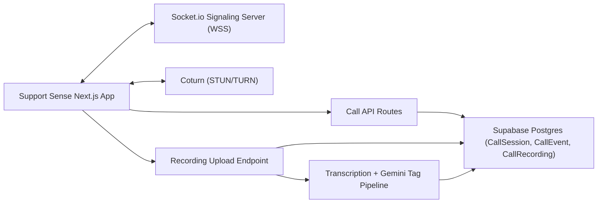

# Support Sense WebRTC Migration (Supabase)

## 1) What This Project Is

This is **not** a brand-new application.

You are extending the existing Support Sense app by replacing:

- Google Meet call creation and linking
- Google Drive polling for call artifacts

with an in-app custom call engine using WebRTC.

Everything else stays in your existing product:

- Auth
- Admin/staff dashboards
- Clients/devices/alerts/SOP workflows
- Incident and compliance flows
- Supabase PostgreSQL as source of truth

---

## 2) Simple Goal

When staff starts a support call, the call should happen directly inside Support Sense (PWA), with tablet auto-answer behavior in monitoring mode, and recordings/transcripts flowing back into your existing SOP and Gemini pipeline.

---

## 3) Current vs Target

### Current (today)

1. Staff triggers Google Meet link creation.
2. Recording metadata is handled through Google Meet/Drive integration.
3. Polling/webhooks detect recording/transcript availability.
4. Transcript/tags feed downstream workflows.

### Target (after migration)

1. Staff creates an in-app call session.
2. Signaling server coordinates WebRTC offer/answer/ICE.
3. Tablet in Monitoring mode auto-answers incoming calls.
4. Media/recording handled by your app pipeline.
5. Transcript/tags feed the same downstream workflows.

---

## 4) High-Level Architecture



---

## 5) Existing Code Areas You Will Touch

- Replace/feature-flag these paths:
  - `src/app/api/google-meet/*`
  - `src/app/api/google-drive/*`
  - `src/lib/google-meet/*`
  - `src/lib/google-drive/*`
- Reuse these foundations:
  - `src/lib/database.ts`
  - `src/lib/auth.ts`
  - existing `Recording`, `Transcript`, `Tag`, `SOPResponse`, `Incident` flows

---

## 6) Implementation Phases

## Phase 0: Preparation and Safety

- Add feature flag: `CALL_PROVIDER=google_meet|custom_webrtc`
- Keep current Google Meet flow working during migration.
- Add branch: `codex/webrtc-migration` (or your naming standard).

**Exit criteria**
- Toggle can switch call provider without breaking existing UI.

---

## Phase 1: Supabase Schema for Calls

Create new tables in Supabase migrations:

- `CallSession`
- `CallParticipant`
- `CallEvent`
- `CallRecording`

Example baseline SQL:

```sql
create table if not exists "CallSession" (
  id text primary key default gen_random_uuid()::text,
  "clientId" text not null references "Client"(id) on delete cascade,
  "alertId" text references "Alert"(id) on delete set null,
  "sopResponseId" text references "SOPResponse"(id) on delete set null,
  status text not null default 'pending', -- pending|ringing|active|ended|failed
  "initiatedBy" text references "User"(id) on delete set null,
  "answeredByDeviceId" text references "Device"(id) on delete set null,
  "startedAt" timestamp,
  "endedAt" timestamp,
  "createdAt" timestamp default current_timestamp,
  "updatedAt" timestamp default current_timestamp
);

create table if not exists "CallParticipant" (
  id text primary key default gen_random_uuid()::text,
  "callSessionId" text not null references "CallSession"(id) on delete cascade,
  "userId" text references "User"(id) on delete set null,
  "deviceId" text references "Device"(id) on delete set null,
  role text not null, -- staff|tablet|observer
  "joinedAt" timestamp,
  "leftAt" timestamp,
  "createdAt" timestamp default current_timestamp
);

create table if not exists "CallEvent" (
  id text primary key default gen_random_uuid()::text,
  "callSessionId" text not null references "CallSession"(id) on delete cascade,
  type text not null, -- invite|offer|answer|ice|connected|ended|failed|timeout
  payload jsonb,
  "createdAt" timestamp default current_timestamp
);

create table if not exists "CallRecording" (
  id text primary key default gen_random_uuid()::text,
  "callSessionId" text not null references "CallSession"(id) on delete cascade,
  "recordingUrl" text,
  "storagePath" text,
  "transcriptId" text references "Transcript"(id) on delete set null,
  "processingStatus" text default 'pending', -- pending|processing|completed|failed
  "createdAt" timestamp default current_timestamp,
  "updatedAt" timestamp default current_timestamp
);

create index if not exists idx_callsession_client on "CallSession"("clientId");
create index if not exists idx_callsession_status on "CallSession"(status);
create index if not exists idx_callevent_session on "CallEvent"("callSessionId");
create index if not exists idx_callrecording_session on "CallRecording"("callSessionId");
```

**Exit criteria**
- Migrations apply cleanly in Supabase.
- CRUD queries work from app code.

---

## Phase 2: Signaling Server (Node.js + Socket.io)

Create separate service: `realtime-signaling/`.

Responsibilities:
- Authenticate socket using short-lived token from Support Sense API.
- Join room per `callSessionId`.
- Forward signaling messages:
  - `call:invite`
  - `call:offer`
  - `call:answer`
  - `call:ice`
  - `call:end`
- Persist call events via internal API or direct DB calls.

Minimal event contract:

```json
{
  "callSessionId": "string",
  "from": "staff|tablet",
  "to": "staff|tablet",
  "payload": {}
}
```

**Exit criteria**
- Two clients can complete WebRTC signaling roundtrip via server.

---

## Phase 3: TURN/STUN Infrastructure (Coturn on Ubuntu)

Install and configure Coturn:

- Open ports:
  - `3478` (UDP/TCP)
  - `5349` (TLS optional but recommended)
  - relay range (example `49152-65535` UDP)
- Configure realm and credentials.

In client ICE config:

```ts
const pc = new RTCPeerConnection({
  iceServers: [
    { urls: ["stun:your-domain:3478"] },
    {
      urls: ["turn:your-domain:3478?transport=udp", "turn:your-domain:3478?transport=tcp"],
      username: process.env.NEXT_PUBLIC_RTC_TURN_USERNAME!,
      credential: process.env.NEXT_PUBLIC_RTC_TURN_CREDENTIAL!,
    },
  ],
});
```

**Exit criteria**
- Calls connect across mobile network + corporate Wi-Fi (not only local LAN).

---

## Phase 4: New API Routes in Existing Next.js App

Add routes:

- `POST /api/calls/create`
- `POST /api/calls/[id]/invite`
- `POST /api/calls/[id]/end`
- `GET /api/calls/[id]`
- `POST /api/calls/[id]/token` (ephemeral signaling auth token)
- `POST /api/calls/[id]/recording` (optional chunk/finalize endpoint)

Rules:
- staff can create/invite/end
- tablet device account can answer/end own call
- all events stored in `CallEvent`

**Exit criteria**
- Staff dashboard can create and control call lifecycle without Meet links.

---

## Phase 5: Frontend Call Engine in PWA

Create modules:

- `src/lib/webrtc/peer.ts` (peer connection logic)
- `src/lib/webrtc/signaling.ts` (socket client)
- `src/components/calls/*` (UI)

Add Monitoring Mode:
- one user tap activates monitoring state
- app listens for incoming call event
- if monitoring is active, auto-run answer flow

Add Wake Lock:

```ts
let wakeLock: WakeLockSentinel | null = null;
if ("wakeLock" in navigator) {
  wakeLock = await navigator.wakeLock.request("screen");
}
```

**Exit criteria**
- Tablet can receive and auto-answer when monitoring is active.

---

## Phase 6: Recording + Transcript + Gemini Pipeline

Replace Meet/Drive artifact dependency with direct recording path:

- capture via `MediaRecorder`
- upload chunks or final blob to your endpoint/storage
- create `CallRecording`
- transcribe
- reuse Gemini tag generation

Keep compatibility with existing records:
- map `CallRecording` output into existing transcript/tag/SOP recommendations where possible

**Exit criteria**
- Completed call produces recording/transcript/tags visible in current workflows.

---

## Phase 7: Kiosk and Device Hardening

On Fully Kiosk Browser:
- grant camera/mic permissions
- keep app full-screen
- disable sleep where possible
- auto-launch PWA URL on boot

In-app:
- reconnect WebSocket on drops
- heartbeat/presence every N seconds
- show “monitoring active” health status

**Exit criteria**
- Device remains call-ready for long sessions.

---

## 7) Environment Variables

### Existing (keep)
- `DATABASE_URL` (Supabase pooler connection)
- `NEXTAUTH_URL`
- `NEXTAUTH_SECRET`

### New for custom calls
- `CALL_PROVIDER=custom_webrtc`
- `SIGNALING_SERVER_URL=wss://signal.yourdomain.com`
- `RTC_STUN_URL=stun:turn.yourdomain.com:3478`
- `RTC_TURN_URL=turn:turn.yourdomain.com:3478?transport=udp`
- `RTC_TURN_USERNAME=...`
- `RTC_TURN_CREDENTIAL=...`
- `CALL_TOKEN_SECRET=...`
- `CALL_RECORDING_BUCKET=...` (if using Supabase Storage/S3)

Frontend public variants (if needed):
- `NEXT_PUBLIC_SIGNALING_SERVER_URL`
- `NEXT_PUBLIC_RTC_STUN_URL`
- `NEXT_PUBLIC_RTC_TURN_URL`

---

## 8) Security Requirements

- HTTPS and WSS only
- short-lived call tokens (1-5 minutes)
- role checks at route and socket levels
- audit log all call state changes (`CallEvent`)
- do not expose TURN static creds in insecure clients unless unavoidable
- protect cron/internal endpoints and rate-limit call creation

---

## 9) QA Checklist

- Staff can start call from alert/client context.
- Tablet in monitoring mode auto-answers.
- Two-way audio/video works on LTE and office Wi-Fi.
- Wake lock and reconnect behavior verified.
- Ending call updates status in DB.
- Recording/transcript/tag records created and linked.
- Existing non-call features still work.
- Feature flag can fallback to Google Meet flow.

---

## 10) Rollout Plan

1. Dev: signaling + TURN + one test tablet.
2. Pilot: one real client with feature flag.
3. Dual-run: keep Meet fallback enabled.
4. Production default: custom WebRTC.
5. Remove Meet/Drive code after stable period.

---

## 11) Cursor AI Execution Plan (IGNORE THIS FOR NOW)

Use these prompts sequentially in Cursor.

### Prompt A: Create DB migration

“Create a SQL migration in `database/` to add `CallSession`, `CallParticipant`, `CallEvent`, and `CallRecording` with indexes and timestamp triggers matching existing naming conventions. Do not modify existing tables yet.”

### Prompt B: Add call APIs

“Implement Next.js API routes under `src/app/api/calls` for create, invite, end, token, and fetch status. Reuse `getServerSession(authOptions)` and `query()` helper. Add strict role checks.”

### Prompt C: Add signaling client abstraction

“Create `src/lib/webrtc/signaling.ts` and `src/lib/webrtc/peer.ts` for Socket.io signaling and RTCPeerConnection lifecycle (offer/answer/ICE, reconnect, cleanup).”

### Prompt D: Add tablet monitoring mode

“Build Monitoring Mode UI/state for tablet with one-tap activation and auto-answer on incoming invite. Add wake lock handling and visibility-state recovery.”

### Prompt E: Integrate recording pipeline

“Add call recording flow using MediaRecorder and upload endpoint. Persist metadata to `CallRecording` and link transcript/tag generation into existing Gemini pipeline.”

### Prompt F: Feature flag switch

“Add a provider switch so call actions use Google Meet or custom WebRTC based on `CALL_PROVIDER`, defaulting to existing behavior if unset.”

---

## 12) Definition of Done

- Meet link is no longer required for supported users.
- In-app call can be initiated, answered, ended, and audited.
- Tablet auto-answer works in monitoring mode.
- Supabase records complete call lifecycle.
- Transcript/tag outputs still reach SOP/incident workflows.
- Google Meet fallback remains available until decommission.

---

## 13) Notes Specific to Supabase

- Continue using your existing `DATABASE_URL` pooler pattern.
- If you add Supabase Realtime later, you may reduce custom signaling complexity, but Socket.io remains the clearest migration path now.
- For recordings, Supabase Storage is acceptable for MVP; add retention and access policies early.

